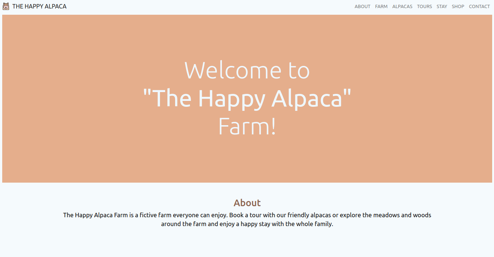

# Alpaca Farm!
-This website is fully responsive and uses basically HTML and SCSS. The wireframe, color pallete and pictures were previsouly provided.

## Built with
-Semantic HTML5 markup

-CSS3

-Sass

-Bootstrap 

## Screenshot

